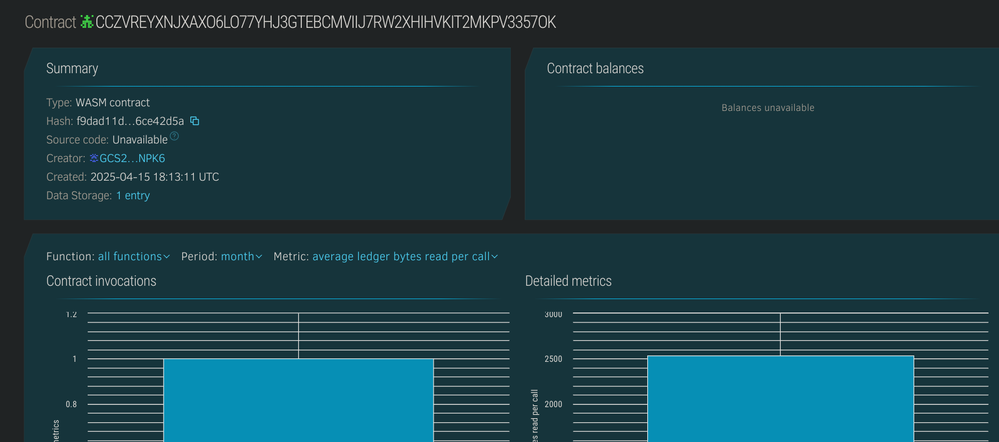

# Basic NFT Minter

## Project Description
The Basic NFT Minter is a Soroban smart contract that allows users to mint non-fungible tokens (NFTs) with a name and metadata URI. Each NFT is associated with a unique ID and an owner's wallet address. This contract provides simple functions to mint, retrieve, and track NFTs.

## Project Vision
The vision of this project is to provide an easy-to-use and lightweight NFT minting solution for decentralized applications on the Stellar blockchain using Soroban. This contract can serve as a foundational component for more complex NFT marketplaces or collectible platforms.

## Key Features
- 🔨 **Mint NFTs:** Any user can mint a new NFT with custom metadata.
- 🔍 **View NFT Info:** Fetch details of a minted NFT using its ID.
- 📊 **Track Supply:** Query total number of NFTs minted.

## Future Scope
- 🔐 Add ownership checks and transfer functionality.
- 🛠 Support metadata standards (e.g., ERC-721-like metadata).
- 🎨 Integrate with NFT marketplaces or art galleries.
- 💬 Add on-chain metadata editing and royalties support.

## Contract Details
CCZVREYXNJXAXO6LO77YHJ3GTEBCMVIIJ7RW2XHIHVKIT2MKPV3357OK
